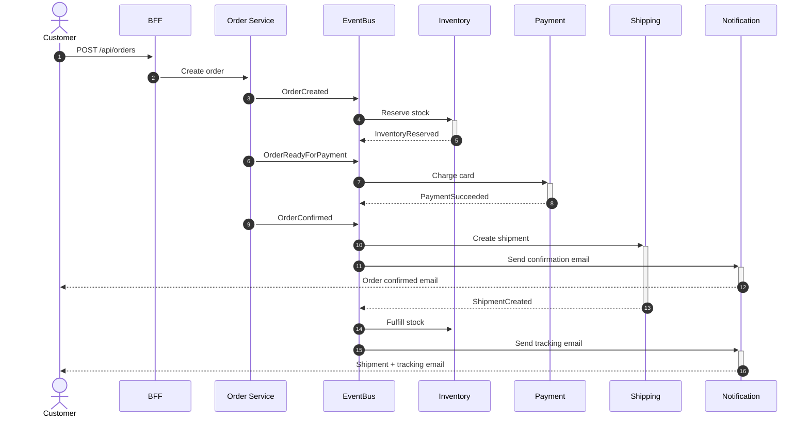

# ShopCloud — Event-Driven E-Commerce Microservices

A serverless e-commerce platform built with AWS CDK (TypeScript). Seven independent microservices communicate exclusively through a shared EventBridge event bus — no direct service-to-service calls.

## Team

| Member | Role | Services |
|--------|------|----------|
| M1 (Jonathan) | Platform + Gateway | Cognito, API Gateway, CloudFront, BFF Lambda, User service |
| M2 (Charles) | Order + Payment | Order saga orchestration, idempotent payments, Stripe integration |
| M3 (Chang) | Product + Cart | Product catalog (Go/ECS), Cart with Redis sessions (Go/ECS) |
| M4 (Xihuan) | Inventory, Shipping, Notification + CI/CD | Stock reservation, shipment tracking, email notifications |

## Architecture

```
                         CloudFront (CDN)
                              |
                     API Gateway (JWT auth)
                         /         \
                    BFF Lambda    User Service
                     /     \          |
              [Products]  [Orders]  [DynamoDB]
                  |           |
            Product Svc   Order Svc -----> EventBridge Bus
            (ECS/ALB)     (Lambda)              |
                              |        +--------+--------+--------+
                          Saga Engine  |        |        |        |
                              |     Inventory Payment Shipping Notification
                              |     (Lambda)  (Lambda) (Lambda)  (Lambda)
                              |        |        |        |        |
                              +--------+--------+--------+--------+
                                    DynamoDB Tables + SQS Queues
```

### Event Flow (Happy Path)



### Compensation Flow (Payment Fails)

```
OrderCreated -> InventoryReserved -> OrderReadyForPayment -> PaymentFailed
    -> CompensateInventory -> InventoryReleased -> OrderCanceled
    -> Notification sends cancellation email
```

## Project Structure

```
ecommerce-microservice/
├── bin/ecomm.ts                    # CDK app entry point (all 7 stacks)
├── lib/
│   ├── shared-stack.ts             # EventBridge bus, SSM parameters
│   ├── platform-stack.ts           # Cognito, API GW, CloudFront, BFF, User svc
│   ├── order-payment-stack.ts      # Order + Payment Lambdas, DynamoDB, SQS
│   ├── product-cart-stack.ts       # ECS Fargate, ALB, DynamoDB, Redis
│   ├── inventory-stack.ts          # Inventory Lambda, DynamoDB, SQS
│   ├── shipping-stack.ts           # Shipping Lambda, DynamoDB, SQS
│   └── notification-stack.ts       # Notification Lambda, SES, SQS
├── services/
│   ├── order/                      # Order service (Python) — saga, compensation
│   ├── payment/                    # Payment service (Python) — Stripe, idempotency
│   ├── inventory/                  # Inventory service (Python) — reservation/release
│   ├── shipping/                   # Shipping service (Python) — tracking
│   ├── notification/               # Notification service (Python) — SES emails
│   ├── product/                    # Product service (Go) — catalog CRUD
│   └── cart/                       # Cart service (Go) — Redis sessions
├── lambda/
│   ├── bff/                        # BFF Lambda (TypeScript) — aggregation layer
│   ├── user-service/               # User service Lambda (TypeScript)
│   └── post-confirm/               # Cognito post-confirm trigger (TypeScript)
├── layers/common/                  # Shared Python Lambda layer
│   └── python/
│       ├── common/                 # M4 utilities (event_utils, logger, responses)
│       └── shared/                 # M2 utilities (events, exceptions, logger)
├── frontend/index.html             # SPA frontend (S3 + CloudFront)
├── tests/                          # Test suites
└── .github/workflows/ci.yml       # CI/CD pipeline
```

## CDK Stacks

| Stack | Owner | Resources |
|-------|-------|-----------|
| `SharedStack` | M4 | EventBridge bus (`ecommerce-event-bus`), SSM parameters |
| `PlatformStack` | M1 | Cognito, HTTP API Gateway, CloudFront, S3, BFF + User Lambdas, DLQ, alarms |
| `OrderPaymentStack` | M2 | OrdersTable, SagaStateTable, PaymentsTable, IdempotencyKeysTable, 3 Lambdas, 2 SQS queues |
| `ProductCartStack` | M3 | VPC, ECS cluster, ALB, Fargate tasks (product + cart + Redis), ProductsTable |
| `InventoryStack` | M4 | InventoryTable, ReservationsTable, Lambda, SQS queue + DLQ |
| `ShippingStack` | M4 | ShipmentsTable, Lambda, SQS queue + DLQ |
| `NotificationStack` | M4 | Lambda, SES policy, SQS queue + DLQ |

## EventBridge Events

| Event | Source | Consumed By |
|-------|--------|-------------|
| `OrderCreated` | `order-service` | inventory, notification, user-service |
| `OrderReadyForPayment` | `order-service` | payment |
| `OrderConfirmed` | `order-service` | shipping, notification, user-service |
| `OrderCanceled` | `order-service` | inventory, notification, user-service |
| `CompensateInventory` | `order-service` | inventory |
| `PaymentSucceeded` | `payment-service` | order (saga) |
| `PaymentFailed` | `payment-service` | order (saga) |
| `InventoryReserved` | `inventory-service` | order (saga) |
| `InventoryReservationFailed` | `inventory-service` | order (saga) |
| `InventoryReleased` | `inventory-service` | order (saga) |
| `ShipmentCreated` | `shipping-service` | inventory, notification |
| `ProductCreated` | `product-service` | inventory |
| `ProductRestocked` | `product-service` | inventory |

## API Routes

| Method | Path | Auth | Handler | Description |
|--------|------|------|---------|-------------|
| GET | `/health` | No | BFF | Liveness check |
| GET | `/api/products` | No | BFF | Product catalog |
| GET | `/api/products/{id}` | No | BFF | Single product |
| GET | `/api/search?q=` | No | BFF | Product search |
| POST | `/api/orders` | JWT | BFF -> Order svc | Create order (starts saga) |
| GET | `/api/orders/{id}` | JWT | BFF -> Order svc | Order details |
| GET | `/api/me` | JWT | User svc | User profile |
| PUT | `/api/me` | JWT | User svc | Update profile |
| GET | `/api/me/cart` | JWT | User svc | Get cart |
| POST | `/api/me/cart` | JWT | User svc | Add to cart |
| DELETE | `/api/me/cart/{itemId}` | JWT | User svc | Remove from cart |
| GET | `/api/me/orders` | JWT | User svc | Order history |

## Quick Start

See [DEMO.md](DEMO.md) for detailed deployment and testing instructions.

```bash
npm install
npm run build
npx cdk bootstrap          # first time only
npx cdk deploy --all       # deploy all 7 stacks
```

## Useful Commands

| Command | Description |
|---------|-------------|
| `npm run build` | Compile TypeScript CDK code |
| `npx cdk synth` | Synthesize CloudFormation templates |
| `npx cdk deploy --all` | Deploy all stacks |
| `npx cdk deploy SharedStack OrderPaymentStack` | Deploy specific stacks |
| `npx cdk diff` | Compare deployed vs local |
| `npx cdk destroy --all` | Tear down all resources |

## Technology Stack

| Layer | Technology |
|-------|-----------|
| IaC | AWS CDK (TypeScript) |
| API | API Gateway HTTP API + JWT Authorizer |
| Auth | Cognito User Pool |
| Compute | Lambda (Python 3.11, Node.js 20) + ECS Fargate (Go) |
| Database | DynamoDB (on-demand) |
| Cache | Redis (ECS sidecar) |
| Eventing | EventBridge + SQS (with DLQs) |
| CDN | CloudFront + S3 |
| Monitoring | CloudWatch alarms + SNS alerts |
| CI/CD | GitHub Actions |
