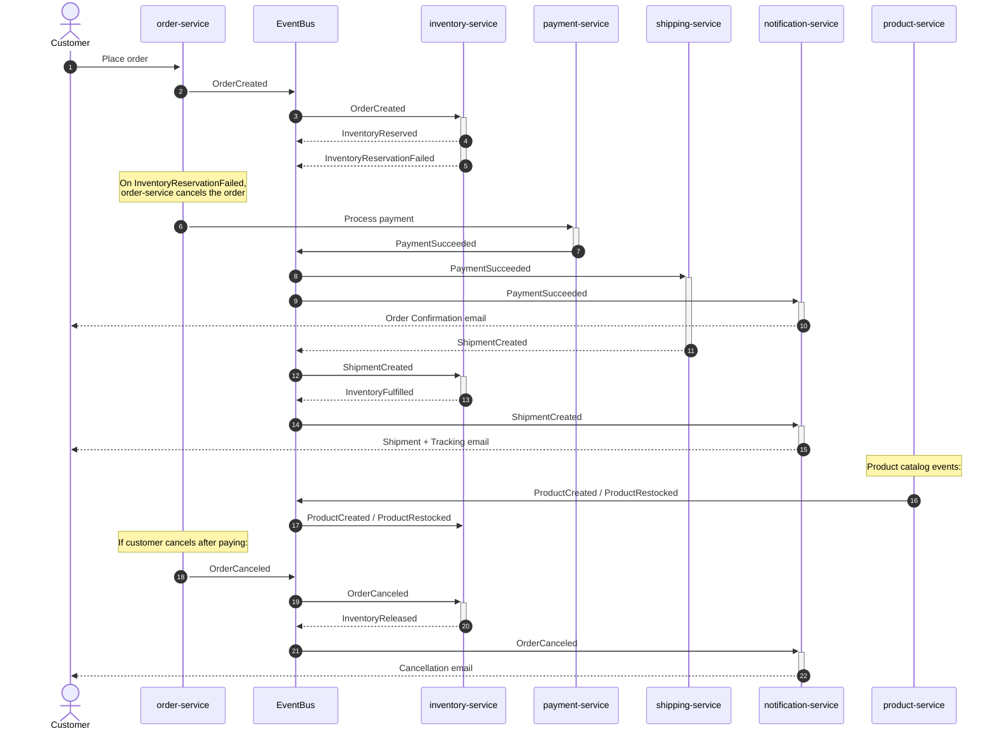

# Ecommerce Event-Driven Microservices

A serverless ecommerce backend built with AWS CDK (TypeScript) and Python Lambdas. Services communicate exclusively through a shared EventBridge event bus — no direct service-to-service calls.

## Services

**Owned by this repo:**

| Service                                        | Description                                                                                           |
| ---------------------------------------------- | ----------------------------------------------------------------------------------------------------- |
| [inventory-service](services/inventory/)       | Reserves, releases, and fulfills stock. Tracks per-order reservations and publishes low-stock alerts. |
| [shipping-service](services/shipping/)         | Creates shipment records and issues tracking numbers on payment confirmation.                         |
| [notification-service](services/notification/) | Sends transactional emails (order confirmation, shipment, cancellation) via AWS SES.                  |

**External dependencies (teammate services):**

| Service           | Events published                                 | Consumed by                             |
| ----------------- | ------------------------------------------------ | --------------------------------------- |
| `order-service`   | `OrderCreated`, `OrderCanceled`, `OrderReturned` | inventory-service, notification-service |
| `payment-service` | `PaymentSucceeded`                               | shipping-service, notification-service  |
| `product-service` | `ProductCreated`, `ProductRestocked`             | inventory-service                       |

## Architecture



## Stacks

| Stack               | Resources                                                                     |
| ------------------- | ----------------------------------------------------------------------------- |
| `SharedStack`       | EventBridge bus, SSM parameters                                               |
| `InventoryStack`    | InventoryTable, ReservationsTable, Lambda, SQS queue + DLQ, EventBridge rules |
| `ShippingStack`     | ShipmentsTable (+ orderId GSI), Lambda, SQS queue + DLQ, EventBridge rule     |
| `NotificationStack` | Lambda, SES policy, SQS queue + DLQ, EventBridge rules                        |

## Deploy

```bash
npm run build
npx cdk deploy --all
```

Requires AWS CLI configured with valid credentials (`aws sts get-caller-identity` to verify).

## Demo

```bash
source .venv/bin/activate
python3 scripts/demo.py
```

Fires the full happy-path event sequence against the deployed stack and prints CloudWatch log output from each service in real time.

## Useful commands

| Command                | Description                             |
| ---------------------- | --------------------------------------- |
| `npm run build`        | Compile TypeScript                      |
| `npx cdk synth`        | Synthesize CloudFormation templates     |
| `npx cdk deploy --all` | Deploy all stacks                       |
| `npx cdk diff`         | Compare deployed stack with local state |
