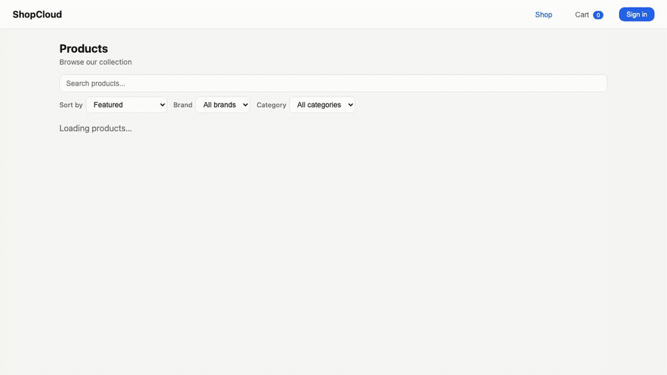

# ShopCloud — Cloud-Native E-Commerce Microservices Platform

A production-grade, event-driven e-commerce platform built with **7 independently deployable microservices**, orchestrated through the **Saga pattern** for distributed transactions. Deployed on AWS using CDK Infrastructure as Code across Lambda, ECS Fargate, DynamoDB, EventBridge, and more.

---

## Table of Contents

- [Architecture Overview](#architecture-overview)
- [System Architecture Diagram](#system-architecture-diagram)
- [Tech Stack](#tech-stack)
- [Services](#services)
  - [Order Service](#order-service-python--lambda)
  - [Payment Service](#payment-service-python--lambda)
  - [Inventory Service](#inventory-service-python--lambda)
  - [Shipping Service](#shipping-service-python--lambda)
  - [Notification Service](#notification-service-python--lambda)
  - [Product Service](#product-service-go--ecs-fargate)
  - [Cart Service](#cart-service-go--ecs-fargate--redis)
- [Platform Layer](#platform-layer)
- [Admin Dashboard](#admin-dashboard)
- [Event-Driven Architecture](#event-driven-architecture)
- [Saga Orchestration](#saga-orchestration)
- [Key Design Patterns](#key-design-patterns)
- [API Reference](#api-reference)
- [Database Schemas](#database-schemas)
- [Infrastructure & CDK Stacks](#infrastructure--cdk-stacks)
- [CI/CD Pipeline](#cicd-pipeline)
- [Testing](#testing)
- [Project Structure](#project-structure)
- [Getting Started](#getting-started)
- [Demo Walkthrough](#demo-walkthrough)
- [Troubleshooting](#troubleshooting)

---

## Architecture Overview

ShopCloud follows a **polyglot microservices architecture** where each service owns its own data store and communicates exclusively through events via Amazon EventBridge. The system uses the **Saga pattern** to maintain data consistency across services without distributed transactions.

**Key architectural decisions:**

- **Event-driven communication** — Services are fully decoupled; no direct service-to-service calls for writes
- **Saga orchestration** — The Order service orchestrates multi-step workflows (inventory reservation, payment, fulfillment)
- **Polyglot services** — Python (Lambda) for transactional services, Go (ECS Fargate) for high-throughput catalog/cart
- **Backend-for-Frontend (BFF)** — A single Node.js Lambda aggregates downstream services for the frontend
- **Infrastructure as Code** — 100% of infrastructure defined in AWS CDK (TypeScript), deployed via GitHub Actions

---

## System Architecture Diagram

```
                              CloudFront (CDN)
                                    |
                              S3 (Frontend SPA)
                                    |
                            API Gateway (HTTP API)
                           /        |         \
                     [public]   [JWT auth]  [JWT auth]
                        |          |            |
                      BFF       BFF         User Service
                    Lambda      Lambda        Lambda
                   /      \       |          /    |    \
          Product Svc   Inventory  Order Svc  Carts  Profiles  OrderRefs
          (ECS/ALB)    (DynamoDB)  (Lambda)  (DDB)   (DDB)     (DDB)
              |                       |
         DynamoDB              EventBridge
         + S3 imgs         (ecommerce-event-bus)
              |              /    |    |    \     \
         Cart Svc      Order  Payment Inventory Shipping Notification
        (ECS/Redis)    Event   Event   Service   Service   Service
                       Svc     Svc    (Lambda)  (Lambda)  (Lambda)
                        |       |        |         |         |
                      SQS     SQS      SQS       SQS       SQS
                     +DLQ    +DLQ     +DLQ      +DLQ      +DLQ
                        |       |        |         |         |
                     DynamoDB DynamoDB DynamoDB DynamoDB    SES
                     Orders  Payments Inventory Shipments  (email)
                     Sagas   Idempotency Reservations
```

---

## Tech Stack

| Layer | Technology |
|---|---|
| **Frontend** | Vanilla JS SPA, served via S3 + CloudFront |
| **API Gateway** | Amazon API Gateway v2 (HTTP API), JWT authorizer |
| **Auth** | Amazon Cognito (User Pool, JWT tokens) |
| **BFF + User Service** | Node.js / TypeScript (Lambda) |
| **Order, Payment, Inventory, Shipping, Notification** | Python 3.11 (Lambda) |
| **Product Service** | Go 1.23 (ECS Fargate) |
| **Cart Service** | Go 1.23 (ECS Fargate + Redis sidecar) |
| **Event Bus** | Amazon EventBridge |
| **Queues** | Amazon SQS (with dead-letter queues) |
| **Databases** | Amazon DynamoDB (12 tables) |
| **Object Storage** | Amazon S3 (product images, frontend assets) |
| **CDN** | Amazon CloudFront |
| **Email** | Amazon SES (mock mode default) |
| **Payments** | Stripe API (mock mode default) |
| **IaC** | AWS CDK v2 (TypeScript) — 7 stacks |
| **CI/CD** | GitHub Actions (OIDC-based AWS auth) |
| **Testing** | pytest + moto (Python), Jest (CDK/TypeScript) |

---

## Services

ShopCloud has **7 microservices**. Expand each one only when you need details.

| Service | Runtime | Main job |
|---|---|---|
| Order | Python / Lambda | Orchestrates order saga |
| Payment | Python / Lambda | Charges and refunds safely |
| Inventory | Python / Lambda | Reserves and tracks stock |
| Shipping | Python / Lambda | Creates and updates shipments |
| Notification | Python / Lambda | Sends order emails |
| Product | Go / ECS Fargate | Serves product catalog |
| Cart | Go / ECS Fargate + Redis | Manages shopping carts |

<details>
<summary><strong>Order Service (Python / Lambda)</strong></summary>

Creates orders and drives the full order workflow.

- APIs: `POST /orders`, `GET /orders/{id}`, `PUT /orders/{id}/cancel`, `GET /orders`
- Main files: `services/order/handler.py`, `services/order/saga.py`, `services/order/compensation.py`
- Publishes and reacts to saga events through EventBridge

</details>

<details>
<summary><strong>Payment Service (Python / Lambda)</strong></summary>

Handles payment charge/refund steps for the saga.

- Triggered by events like `OrderReadyForPayment` and `CompensatePayment`
- Main files: `services/payment/handler.py`, `services/payment/idempotency.py`, `services/payment/stripe_client.py`
- Supports mock mode by default (`PAYMENT_MODE=mock`)

</details>

<details>
<summary><strong>Inventory Service (Python / Lambda)</strong></summary>

Keeps stock accurate and prevents overselling.

- Reserves, releases, fulfills, and restocks inventory
- Main files: `services/inventory/handler.py`, `services/inventory/service.py`, `services/inventory/repository.py`
- Publishes stock-related events such as `LowStock` and `OutOfStock`

</details>

<details>
<summary><strong>Shipping Service (Python / Lambda)</strong></summary>

Creates shipments after orders are confirmed.

- Triggered by `OrderConfirmed`
- Main files: `services/shipping/handler.py`, `services/shipping/service.py`, `services/shipping/repository.py`
- Shipment states: `CREATED` -> `SHIPPED` -> `DELIVERED`

</details>

<details>
<summary><strong>Notification Service (Python / Lambda)</strong></summary>

Sends customer notifications for important order events.

- Handles events like `OrderConfirmed`, `ShipmentCreated`, `OrderCanceled`
- Main file: `services/notification/handler.py`
- Uses mock email mode by default (`EMAIL_MODE=mock`)

</details>

<details>
<summary><strong>Product Service (Go / ECS Fargate)</strong></summary>

Serves product search and catalog APIs.

- APIs: product list, product detail, search, price check, product update
- Main path: `services/product/`
- Reads from DynamoDB and S3-backed image metadata

</details>

<details>
<summary><strong>Cart Service (Go / ECS Fargate + Redis)</strong></summary>

Stores user carts and item quantities.

- APIs: create cart, add/update items, read cart, delete/deactivate cart
- Main path: `services/cart/`
- Uses Redis for fast cart reads/writes

</details>

---

## Platform Layer

The **PlatformStack** provides cross-cutting concerns for the entire platform:

### Authentication (Cognito)
- Email-based sign-up and sign-in
- JWT tokens (ID token: 1hr, refresh token: 30 days)
- **Pre-signup trigger** — Auto-confirms users (skips email verification)
- **Post-confirmation trigger** — Creates user record in DynamoDB

### BFF (Backend-for-Frontend)
A Node.js Lambda that aggregates downstream services behind a single API:
- Routes product requests to the Product Service (HTTP/ALB)
- Invokes the Order Service Lambda directly
- Reads inventory data from DynamoDB
- Propagates **correlation IDs** through all downstream calls
- Hosts all **unauthenticated admin endpoints** (`/api/admin/*`) — see [Admin Dashboard](#admin-dashboard)

### User Service
Manages user profiles, carts (DynamoDB-backed with 7-day TTL), and order history. Subscribes to `OrderCreated`, `OrderConfirmed`, and `OrderCanceled` events to maintain an order reference index.

### Frontend
Single-page application served via S3 + CloudFront. Auto-configured with API URLs during CDK deployment via inline `config.js`.

### Observability
- **CloudWatch Alarms** — BFF/User error rates (>5 errors) and p99 latency (>3s)
- **DLQ monitoring** — Alarm when dead-letter queues receive messages
- **Structured JSON logging** — All services emit `{timestamp, level, service, correlation_id, message}` via shared logger

---

## Admin Dashboard

A built-in operations dashboard accessible from the frontend SPA. Visible **only** to the admin account (`admin@admin.com` / `Admin123`).

### Access

The **Admin** navigation button in the SPA header is hidden for all regular users. It appears automatically after sign-in when the authenticated email matches `admin@admin.com`. It is hidden again on sign-out.

### 1-Minute Demo (GIF)



### Tabs

| Tab | Description |
|---|---|
| **Overview** | Live stats — total orders, revenue, pending/confirmed/cancelled counts, inventory items, active reservations |
| **Orders** | Full order list with status badges; cancel any order directly from the dashboard |
| **Inventory** | Per-product stock levels with quick-restock and set-exact-quantity controls |
| **Restock / Manage** | Publish a `ProductRestocked` event to EventBridge with a specific product ID and quantity delta |
| **Shipments** | Create shipments for CONFIRMED orders, enter tracking numbers, advance status (CREATED → SHIPPED → DELIVERED) |
| **Event Log** | Reconstructed timeline of saga events from `SagaStateTable` history |
| **Observability** | EventBridge CloudWatch charts (publish throughput, matched events, triggered rules, invocation failures) with auto-refresh |
| **DynamoDB Tables** | Raw table browser — scan any of the 7 core tables (Orders, SagaState, Payments, Inventory, Reservations, Shipments, Idempotency) |

### Shipment Management

1. Select a CONFIRMED order from the dropdown in the Shipments tab.
2. Choose a carrier (UPS / FedEx / USPS / DHL) and enter a tracking number.
3. Click **Create Shipment** — the BFF writes a record to `ShipmentsTable` and publishes a `ShipmentCreated` event to EventBridge.
4. The Inventory Service automatically handles `ShipmentCreated`: marks all reservations for that order as `FULFILLED` and decrements the reserved count in `InventoryTable`.
5. Use **Update Status** to advance the shipment through `CREATED → SHIPPED → DELIVERED`.

### Admin API Routes (No Auth Required)

All admin routes are served by the BFF Lambda without a JWT authorizer so they can be called from the admin SPA page without token scoping issues.

| Method | Path | Description |
|---|---|---|
| `GET` | `/api/admin/orders` | List all orders (scans OrdersTable) |
| `GET` | `/api/admin/stats` | Aggregate counts and revenue totals |
| `GET` | `/api/admin/observability` | Return CloudWatch-backed EventBridge metric series for charts |
| `GET` | `/api/admin/table/{name}` | Scan a raw DynamoDB table by logical name |
| `POST` | `/api/admin/restock` | Publish `ProductRestocked` event to EventBridge |
| `PUT` | `/api/admin/inventory` | Directly set a product's stock quantity in DynamoDB |
| `POST` | `/api/admin/ship` | Create a shipment + publish `ShipmentCreated` |
| `PUT` | `/api/admin/shipment` | Update shipment status / tracking number |
| `POST` | `/api/admin/orders/{id}/cancel` | Cancel an order (no JWT required) |

---

## Event-Driven Architecture

All inter-service communication flows through a central **EventBridge bus** (`ecommerce-event-bus`). Each service publishes and subscribes to specific event types, routed through SQS queues with dead-letter queues for failure handling.

### Event Catalog

| Source | Event Type | Consumers | Purpose |
|---|---|---|---|
| `order-service` | `OrderCreated` | Inventory, User | New order — triggers saga |
| `order-service` | `OrderReadyForPayment` | Payment | Inventory reserved — charge card |
| `order-service` | `OrderConfirmed` | Shipping, Notification, User | Payment succeeded — fulfill order |
| `order-service` | `OrderCanceled` | Notification, User | Order cancelled |
| `order-service` | `CompensateInventory` | Inventory | Saga rollback — release reserved stock |
| `order-service` | `CompensatePayment` | Payment | Saga rollback — refund charge |
| `payment-service` | `PaymentSucceeded` | Order | Charge completed |
| `payment-service` | `PaymentFailed` | Order | Charge failed — trigger compensation |
| `payment-service` | `PaymentRefunded` | Order | Refund completed — marks order status as REFUNDED |
| `inventory-service` | `InventoryReserved` | Order | Stock reserved for order |
| `inventory-service` | `InventoryReservationFailed` | Order | Insufficient stock |
| `inventory-service` | `InventoryReleased` | Order | Stock released after compensation |
| `inventory-service` | `LowStock` | Product | Stock below threshold |
| `inventory-service` | `OutOfStock` | Product | Product out of stock |
| `inventory-service` | `StockReplenished` | Product | Stock added |
| `shipping-service` | `ShipmentCreated` | Inventory, Notification | Shipment created with tracking |
| `product-service` | `ProductCreated` | Inventory | New product — initialize stock |
| `product-service` | `ProductRestocked` | Inventory | Stock replenished |

---

## Saga Orchestration

The Order Service implements the **Saga pattern** to coordinate distributed transactions across Inventory and Payment services without two-phase commit.

### Happy Path

```
User places order
       |
       v
   [PENDING]
       |  publish: OrderCreated
       v
[INVENTORY_RESERVING]
       |  receive: InventoryReserved
       v
[PAYMENT_PROCESSING]
       |  publish: OrderReadyForPayment
       |  receive: PaymentSucceeded
       v
  [CONFIRMED]
       |  publish: OrderConfirmed
       v
  Shipping creates shipment            Admin can manually ship order
  Notification sends confirmation      → publish: ShipmentCreated
  Inventory marks items as fulfilled   → Inventory: RESERVED → FULFILLED
       |
       |  (on CompensatePayment → refund)
       v
  [REFUNDED]  ← receive: PaymentRefunded
```

### Failure & Compensation

```
[INVENTORY_RESERVING]                [PAYMENT_PROCESSING]
       |                                     |
  InventoryReservationFailed            PaymentFailed
       |                                     |
       v                                     v
  [CANCELLED]                        [COMPENSATING]
  (no compensation needed)                   |
                                  publish: CompensateInventory
                                             |
                                    Inventory releases stock
                                             |
                                    receive: InventoryReleased
                                             |
                                             v
                                       [CANCELLED]
```

**Saga state is persisted** in a dedicated DynamoDB table with full transition history (timestamps, reasons) for audit and debugging.

---

## Key Design Patterns

| Pattern | Where | Implementation |
|---|---|---|
| **Saga (Orchestration)** | Order Service | State machine in `saga.py` drives multi-step workflow; `compensation.py` handles rollbacks |
| **Idempotency** | Payment Service | DynamoDB key cache + Stripe native idempotency prevents duplicate charges (`idempotency.py`) |
| **Circuit Breaker** | Payment Service | `stripe_client.py` — state stored in DynamoDB (`IdempotencyKeysTable`, key `cb:stripe`), shared across all Lambda instances. Prevents cascading failures when Stripe is down. |
| **Optimistic Locking** | Inventory Service | DynamoDB `TransactWriteItems` with conditional expressions prevents overselling |
| **Event Sourcing (lite)** | Order Service | `SagaStateTable` records all state transitions with timestamps |
| **CQRS (lite)** | User Service | `OrderRefTable` provides a read-optimized order history index |
| **BFF Aggregation** | Platform | Single Lambda routes and aggregates responses from multiple backend services |
| **Correlation ID** | All services | `X-Correlation-Id` header propagated through API Gateway → Lambda → EventBridge → all consumers |
| **Dead Letter Queues** | All event consumers | Failed events land in DLQs for inspection and reprocessing |

---

## API Reference

### Public Endpoints (No Auth)

| Method | Path | Handler | Description |
|---|---|---|---|
| `GET` | `/health` | BFF | Liveness check |
| `GET` | `/api/products` | BFF → Product Svc | Paginated product catalog |
| `GET` | `/api/products/{id}` | BFF → Product Svc | Single product details |
| `GET` | `/api/search?q=` | BFF → Product Svc | Full-text product search |
| `GET` | `/api/inventory` | BFF → DynamoDB | Stock levels |

### Authenticated Endpoints (JWT Required)

| Method | Path | Handler | Description |
|---|---|---|---|
| `POST` | `/api/orders` | BFF → Order Svc | Create order (triggers saga) |
| `GET` | `/api/orders/{id}` | BFF → Order Svc | Order status and details |
| `POST` | `/api/orders/{id}/cancel` | BFF → Order Svc | Cancel order (requires JWT) |
| `GET` | `/api/me` | User Service | Get user profile |
| `PUT` | `/api/me` | User Service | Update profile |
| `GET` | `/api/me/cart` | User Service | Get shopping cart |
| `POST` | `/api/me/cart` | User Service | Add item to cart |
| `DELETE` | `/api/me/cart` | User Service | Clear cart |
| `DELETE` | `/api/me/cart/{itemId}` | User Service | Remove cart item |
| `GET` | `/api/me/orders` | User Service | Order history |

### Admin Endpoints (No Auth — admin SPA only)

| Method | Path | Handler | Description |
|---|---|---|---|
| `GET` | `/api/admin/orders` | BFF | List all orders |
| `GET` | `/api/admin/stats` | BFF | Aggregate stats (counts, revenue) |
| `GET` | `/api/admin/table/{name}` | BFF | Scan raw DynamoDB table |
| `POST` | `/api/admin/restock` | BFF → EventBridge | Publish ProductRestocked event |
| `PUT` | `/api/admin/inventory` | BFF → DynamoDB | Set product stock quantity |
| `POST` | `/api/admin/ship` | BFF → DynamoDB + EventBridge | Create shipment + publish ShipmentCreated |
| `PUT` | `/api/admin/shipment` | BFF → DynamoDB | Update shipment status / tracking |
| `POST` | `/api/admin/orders/{id}/cancel` | BFF → Order Svc | Cancel order (no JWT required) |

**CORS:** All origins (`*`), methods (GET/POST/PUT/DELETE/OPTIONS), headers (Authorization, Content-Type, X-Idempotency-Key, X-Correlation-Id)

**Rate limiting:** 100 requests/sec, 500 burst

---

## Database Schemas

### DynamoDB Tables (12 total)

| Table | Partition Key | Sort Key | GSI | TTL | Stack |
|---|---|---|---|---|---|
| `Orders` | `order_id` (S) | — | — | — | OrderPayment |
| `SagaState` | `order_id` (S) | — | — | — | OrderPayment |
| `Payments` | `payment_id` (S) | — | `order_id` | — | OrderPayment |
| `IdempotencyKeys` | `idempotency_key` (S) | — | — | Yes | OrderPayment |
| `InventoryTable` | `productId` (S) | — | — | — | Inventory |
| `ReservationsTable` | `orderId` (S) | `productId` (S) | — | — | Inventory |
| `ShipmentsTable` | `shipmentId` (S) | — | `orderId` | — | Shipping |
| `Users` | `userId` (S) | — | `email` | — | Platform |
| `Carts` | `userId` (S) | — | — | 7 days | Platform |
| `OrderRef` | `userId` (S) | `orderId` (S) | — | — | Platform |
| `Sessions` | `sessionId` (S) | — | — | Yes | Platform |
| `products` | `product_id` (N) | `category` (S) | — | — | ProductCart |

---

## Infrastructure & CDK Stacks

The entire platform is defined in **7 AWS CDK stacks** with explicit dependency ordering:

```
SharedStack (EventBridge bus, SSM params)
    |
    +---> OrderPaymentStack (Order/Payment Lambdas, 4 DynamoDB tables, 2 SQS queues)
    |         |
    +---> ProductCartStack (VPC, ECS Fargate, ALB, DynamoDB, S3)
    |         |
    +---> InventoryStack (Inventory Lambda, 2 DynamoDB tables, SQS queue)
    |         |
    +---> PlatformStack (API Gateway, Cognito, CloudFront, BFF, User Service)
    |         ^--- depends on OrderPayment, ProductCart, Inventory
    |
    +---> ShippingStack (Shipping Lambda, DynamoDB, SQS queue)
    |
    +---> NotificationStack (Notification Lambda, SES permissions, SQS queue)
```

| Stack | Resources | Description |
|---|---|---|
| **SharedStack** | EventBridge bus, 2 SSM params | Shared event infrastructure |
| **OrderPaymentStack** | 3 Lambdas, 4 DynamoDB tables, 2 SQS queues + DLQs, 7 EventBridge rules | Order saga + payment processing (includes `PaymentRefunded` → Order rule) |
| **ProductCartStack** | VPC (2 AZs), ECS cluster, 2 Fargate services, ALB, DynamoDB, S3 | Product catalog + cart (containers) |
| **PlatformStack** | API Gateway, Cognito, 4 Lambdas, 4 DynamoDB tables, S3, CloudFront, CloudWatch alarms | API layer + auth + frontend |
| **InventoryStack** | 1 Lambda, 2 DynamoDB tables, SQS + DLQ, 7 EventBridge rules | Stock management |
| **ShippingStack** | 1 Lambda, 1 DynamoDB table, SQS + DLQ, 1 EventBridge rule | Order fulfillment |
| **NotificationStack** | 1 Lambda, SQS + DLQ, 3 EventBridge rules, SES permissions | Email notifications |

---

## CI/CD Pipeline

### CI (Every push & PR)

```yaml
# .github/workflows/ci.yml
Python 3.11 → pip install → pytest          # Unit tests (moto mocks)
Node.js 20  → npm ci → tsc → jest → cdk synth  # CDK tests + template validation
```

### CD (Push to main only)

```yaml
# .github/workflows/cd.yml
OIDC auth → AWS credentials → cdk deploy (all stacks)
```

- **Authentication:** GitHub OIDC → AWS IAM role (no long-lived secrets)
- **Deployment:** `cdk deploy` with `--require-approval never`
- **Strategy:** Full stack deployment on every merge to main

---

## Testing

### Test Suite

| Scope | Framework | Mock Layer | Tests |
|---|---|---|---|
| Order Service | pytest | moto (DynamoDB, EventBridge) | 20 tests — API routing, saga state machine, DynamoDB CRUD |
| Payment Service | pytest | moto + mock Stripe | 4 tests — charge, idempotency, card decline, refund |
| Inventory Service | pytest | moto (DynamoDB, EventBridge) | 15 tests — reserve, release, fulfill, restock, low-stock alerts |
| Shipping Service | pytest | moto | 5 tests — shipment creation, idempotency |
| Notification Service | pytest | moto (SES) | 8 tests — email templates, SES/mock modes |
| CDK Stacks | Jest | CDK assertions | 18 tests — resource creation, IAM policies, EventBridge rules |

### Running Tests

```bash
# Python service tests
pip install -r requirements.txt
pytest --tb=short -q

# CDK infrastructure tests
npm install
npm run build
npm test
```

### Test Infrastructure

Tests use [moto](https://github.com/getmoto/moto) to mock AWS services in-process. Shared fixtures in `tests/conftest.py` create all DynamoDB tables and EventBridge buses needed by each service, enabling fast, isolated unit tests without AWS credentials.

---

## Project Structure

```
ecommerce-microservice/
|
+-- bin/ecomm.ts                              # CDK app entry point
|
+-- lib/                                      # CDK infrastructure stacks
|   +-- shared-stack.ts                       # EventBridge + SSM
|   +-- order-payment-stack.ts                # Order/Payment Lambdas, tables, queues
|   +-- platform-stack.ts                     # API Gateway, Cognito, CloudFront, BFF
|   +-- product-cart-stack.ts                 # VPC, ECS Fargate, ALB
|   +-- inventory-stack.ts                    # Inventory Lambda, tables, queues
|   +-- shipping-stack.ts                     # Shipping Lambda
|   +-- notification-stack.ts                 # Notification Lambda
|
+-- lambda/                                   # Node.js Lambda functions
|   +-- bff/index.ts                          # API aggregation layer
|   +-- user-service/index.ts                 # Profile, cart, order history
|   +-- post-confirm/index.ts                 # Cognito: create user record
|   +-- pre-signup/index.ts                   # Cognito: auto-confirm
|
+-- services/                                 # Microservices
|   +-- order/                                # Python — Saga orchestrator
|   |   +-- handler.py                        # HTTP API + event handler
|   |   +-- saga.py                           # State machine
|   |   +-- compensation.py                   # Rollback logic
|   |   +-- models.py                         # DynamoDB models
|   +-- payment/                              # Python — Stripe integration
|   |   +-- handler.py                        # Charge + refund handler
|   |   +-- idempotency.py                    # Duplicate prevention
|   |   +-- stripe_client.py                  # Stripe API + circuit breaker
|   |   +-- models.py                         # Payment records
|   +-- inventory/                            # Python — Stock management
|   |   +-- handler.py                        # Event dispatcher
|   |   +-- service.py                        # Business logic
|   |   +-- repository.py                     # Atomic DynamoDB transactions
|   |   +-- models.py                         # Data models
|   +-- shipping/                             # Python — Fulfillment
|   |   +-- handler.py                        # Event handler
|   |   +-- service.py                        # Shipment creation
|   |   +-- repository.py                     # DynamoDB operations
|   +-- notification/                         # Python — Email
|   |   +-- handler.py                        # Event handler
|   |   +-- service.py                        # Template rendering
|   |   +-- email_client.py                   # SES / mock client
|   +-- product/                              # Go — Product catalog
|   |   +-- main.go                           # HTTP server + init
|   |   +-- handlers.go                       # REST endpoints
|   |   +-- dynamo.go                         # DynamoDB operations
|   |   +-- s3.go                             # Image uploads
|   |   +-- eventbridge.go                    # Event publishing
|   |   +-- sqs.go                            # Inventory event consumer
|   +-- cart/                                 # Go — Shopping cart
|       +-- main.go                           # HTTP server
|       +-- handlers.go                       # Cart CRUD
|       +-- redis.go                          # Redis integration
|
+-- layers/common/python/                     # Lambda layer (shared code)
|   +-- common/                               # Low-level utilities
|   |   +-- event_utils.py                    # Unwrap SQS/EventBridge events
|   |   +-- logger.py                         # Basic logger
|   |   +-- responses.py                      # HTTP response helpers
|   +-- shared/                               # High-level abstractions
|       +-- events.py                         # EventBridge publisher + event builders
|       +-- exceptions.py                     # Custom exception hierarchy
|       +-- logger.py                         # Structured JSON logger with correlation ID
|
+-- tests/                                    # Test suites
|   +-- conftest.py                           # Shared moto fixtures (tables, buses)
|   +-- order/                                # Order service tests
|   +-- payment/                              # Payment service tests
|   +-- inventory/                            # Inventory service tests
|   +-- shipping/                             # Shipping service tests
|   +-- notification/                         # Notification service tests
|   +-- cdk/stacks.test.ts                    # CDK infrastructure assertions
|
+-- frontend/
|   +-- index.html                            # SPA (vanilla JS + CSS)
|
+-- .github/workflows/
|   +-- ci.yml                                # Test + build + synth
|   +-- cd.yml                                # OIDC deploy to AWS
|
+-- package.json                              # Node/CDK dependencies
+-- requirements.txt                          # Python dependencies
+-- tsconfig.json                             # TypeScript config
+-- jest.config.js                            # Jest config
+-- cdk.json                                  # CDK context + feature flags
+-- DEMO.md                                   # Deployment & demo guide
```

---

## Getting Started

### Prerequisites

- [Node.js 20+](https://nodejs.org)
- [AWS CLI v2](https://aws.amazon.com/cli/) configured with credentials
- [AWS CDK CLI v2](https://docs.aws.amazon.com/cdk/latest/guide/cli.html)
- [Python 3.11+](https://www.python.org/)
- [Docker](https://www.docker.com/) (required for ECS/Fargate services)
- [Go 1.23+](https://go.dev/) (optional, for local product/cart development)

### Quick Start

```bash
# 1. Clone and install
git clone <repo-url>
cd ecommerce-microservice
npm install
pip install -r requirements.txt

# 2. Bootstrap CDK (first time only)
npx cdk bootstrap

# 3. Build TypeScript
npm run build

# 4. Run tests
pytest --tb=short -q   # Python service tests
npm test               # CDK stack tests

# 5. Deploy all stacks
npx cdk deploy --all --require-approval never

# 6. Deploy without Docker (skip ECS services)
npx cdk deploy SharedStack OrderPaymentStack PlatformStack InventoryStack ShippingStack NotificationStack --require-approval never
```

After deployment, CDK outputs the API URL, CloudFront domain, Cognito User Pool ID, and Client ID.

---

## Demo Walkthrough

See [DEMO.md](DEMO.md) for detailed step-by-step instructions including:

1. Creating test users in Cognito
2. Browsing the product catalog via API
3. Placing an order (triggers the full saga flow)
4. Watching events propagate through CloudWatch logs
5. Checking order status and history
6. Using the frontend SPA
7. Signing in as `admin@admin.com` to access the Admin Dashboard
8. Using the Shipments tab to manually enter a tracking number and mark an order as shipped
9. Verifying inventory reservations are fulfilled automatically after shipment

### Quick API Test

```bash
# Health check
curl -s "$API_URL/health" | jq .

# List products
curl -s "$API_URL/api/products" | jq .

# Search
curl -s "$API_URL/api/search?q=keyboard" | jq .

# Create order (requires JWT token)
curl -s -X POST "$API_URL/api/orders" \
  -H "Authorization: Bearer $TOKEN" \
  -H "Content-Type: application/json" \
  -d '{
    "items": [
      {"productId": "p1", "quantity": 1, "price": 89.99}
    ],
    "total": 89.99,
    "shippingAddress": {"street": "123 Main St", "city": "Boston", "state": "MA", "zip": "02101"}
  }' | jq .
```

---

## Troubleshooting

| Issue | Cause | Solution |
|---|---|---|
| Order stuck in `PENDING` | Inventory service waiting for product | Check `inventory-service` CloudWatch logs; ensure product exists in `InventoryTable` |
| `Module not found` in Lambda | Layer not built correctly | Verify `layers/common/python/` contains both `common/` and `shared/` directories |
| ECS tasks restarting | Missing DynamoDB table or Redis | Check task logs; product service needs `products` table, cart service needs Redis sidecar |
| Frontend blank page | CloudFront propagation delay | Wait 2-3 minutes after first deploy; verify `CONFIG` values in `index.html` |
| CORS errors in browser | API Gateway config | Current config allows `*` origins — check API Gateway CORS settings |
| CDK deploy fails with "resource exists" | Orphaned resources from prior deploy | Delete the conflicting resource in AWS Console, then retry |
| DLQ messages accumulating | Service processing failures | Inspect DLQ messages for error details; check corresponding service CloudWatch logs |
| Admin button not visible | Signed in as non-admin account | Sign in as `admin@admin.com` — the Admin nav button only appears for that exact email |
| Shipment creation fails | No CONFIRMED orders in dropdown | Place an order and wait for saga to reach CONFIRMED state before using the Shipments tab |
| Circuit breaker stuck OPEN | Stripe failures exceeded threshold | The `cb:stripe` record in `IdempotencyKeysTable` holds the circuit state; it auto-recovers after 30 s in HALF_OPEN |

### Tear Down

```bash
npx cdk destroy --all
```

> **Warning:** This permanently deletes all data including DynamoDB tables and S3 buckets.

---
